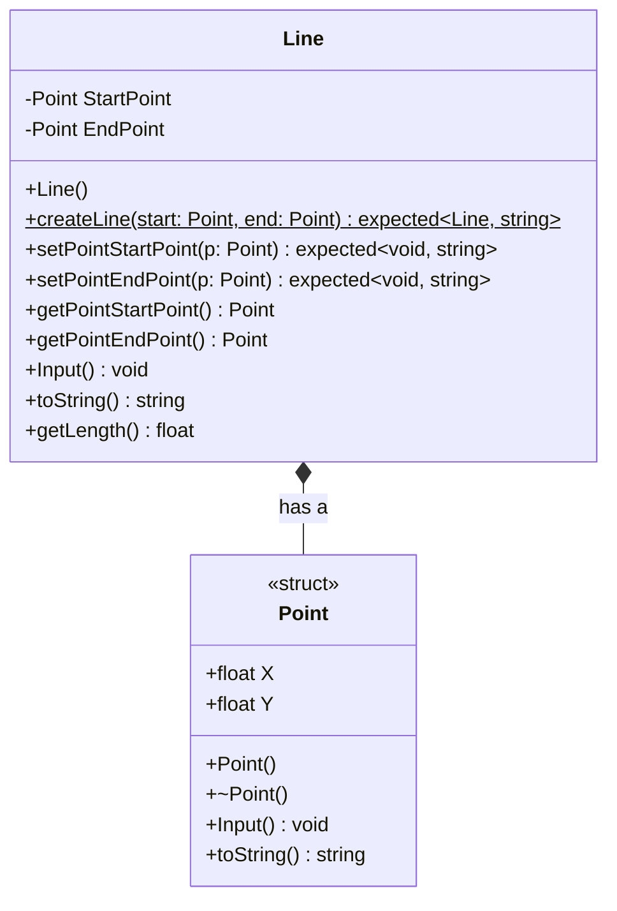

### How to compile
```bash
g++ -std=c++23 *.cpp ../PointInput/2D_Point.cpp -o main
```
### How to run app
```bash
./main
```

### Class Diagram

```mermaid
classDiagram
    class Point {
        <<struct>>
        +float X
        +float Y
        +Point()
        +~Point()
        +Input() void
        +toString() string
    }
    class Line {
        -Point StartPoint
        -Point EndPoint
        +Line()
        +createLine(start: Point, end: Point)$ expected~Line, string~
        +setPointStartPoint(p: Point) expected~void, string~
        +setPointEndPoint(p: Point) expected~void, string~
        +getPointStartPoint() Point
        +getPointEndPoint() Point
        +Input() void
        +toString() string
        +getLength() float
    }
    Line *-- Point : has a
```