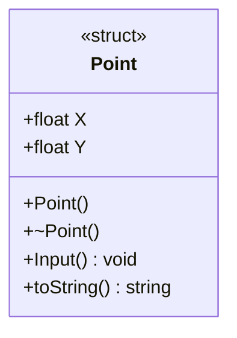

### How to compile
```bash
g++ -std=c++23 *.cpp -o main
```
### Class Diagram

```mermaid
classDiagram
    class Point {
        <<struct>>
        +float X
        +float Y
        +Point()
        +~Point()
        +Input() void
        +toString() string
    }
```